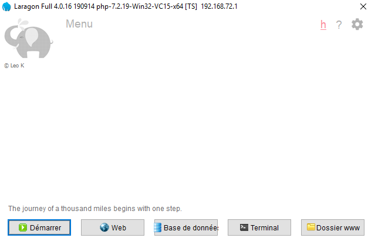
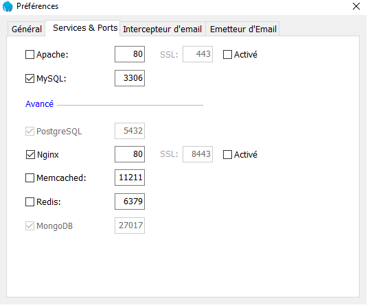
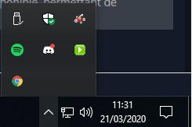
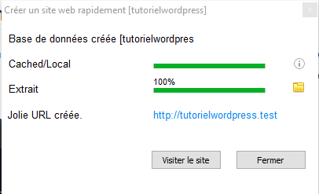

# Tutoriel d'installation de Wordpress

## 1. Introduction :
Dans ses dernières version, WAMP ou XAMPP n'intègrent plus la fonctionnalité pour faire des virtual hosts (qui permettent de créer des URL personnalisées et de pointer le serveur web au bon endroit). Cette étape est légèrement compliqué lorsque l'on est pas habitué à configurer un serveur web.

Cela veut donc dire qu'installer Wordpress avec la méthode décrite dans le document de Mme Ruff **ne fonctionne plus aujourd'hui**. Pour résoudre ce problème, nous allons installer un autre outil qui nous permettra de gérer le serveur web : **Laragon**.

## 2.1. Installation de Laragon :
Pour installer l'outil, il suffit de se rendre sur le [site officiel](https://laragon.org/), sur la page de téléchargements. Il existe plusieurs versions (Full, Lite et Portable). Nous allons choisir la version **Full** afin d'avoir tous les outils nécessaires.

Téléchargez donc l'installateur et installez le logiciel en suivant la procédure. Une fois cette étape terminée, démarrez le logiciel. Une fenêtre de la figure 1 doit s'afficher.

  
Figure 1 : interface de **Laragon**.

Vous êtes maintenant prêt à configurer l'outil avant d'installer Wordpress.

## 2.2. Configuration de Laragon :
Par défaut, **Laragon** utilise le serveur web apache. Vous pouvez le garder mais sachez qu'il est également possible d'utiliser nginx. Pour ce faire, il suffit d'aller dans les paramètres, puis dans *Services & Ports*. On remarque qu'**apache** est bien utilisé par défaut.

Pour utiliser **nginx**, il faut décocher la case d'**apache** et cocher **Nginx**. Par défaut et pour ne pas avoir de conflits, les deux serveurs web utilisent deux ports différents. Pour ne pas avoir à taper port *8080* lorsque l'on se rend sur le site, changez la valeur du port d'**nginx** à *80*. La configuration finale doit ressembler à la figure 2.

  
Figure 2 : paramètres de **Laragon**

## 3.1. Installation de WordPress
En plus de l'interace de **Laragon**, un menu dans la barre des tâches est disponible, permettant de gérer certaines options et créer des projets. Pour le trouver, il suffit de chercher verte de l'outil, comme sur la figure 3.

  
Figure 3 : menu de **Laragon**.

Pour créer un projet, il faut premièrement lancer les serveurs (**nginx** et **mysql**) en faisant un clique droit, puis *Démarrer*. L'icône passe au bleu, tout s'est bien passé. LA deuxième étape consiste à faire à nouveau un clique droit afin d'afficher le menu, aller dans *Créer un site web rapidement* puis sur *WordPress*. Un nom de projet vous sera demandé, puis les fichiers nécéssaires seront téléchargés (l'emplacement par défaut des projets est *C:\laragon\www*). Renseignez un nom de projet et attendez que tous les fichiers soient téléchargés. Voir la figure 4 pour plus de détails.

  
Figure 4 : Installation de **WordPress**.

Une fois cette étape terminée et si tout s'est bien passé, vous pouvez vous rendre sur *{nom du projet}.test* (dans mon cas : *tutorielwordpress.test*).

## 3.2. Configuration de Wordpress :
Après s'être rendu sur le site que vous venez de créer, il faut configurer **WordPress** afin de créer votre premier site. Suivez les instructions jusqu'à arriver à l'étape 2 : *Informations nécessaires*. Le compte que vous créez est le compte adminstrateur du site, pensez à noter les identifiants pour ne pas les oublier. Dans notre exemple, nous n'avons pas besoin de cocher la case *Demander aux moteurs de recherche de ne pas indexer ce site* . Un message de succès s'affiche : votre site est bien configuré ! Dans le cas contraire, lisez le message d'erreur et essayer de résoudre le problème.

## 4. Conclusion :
Voilà ! Vous venez de créer votre premier site **WordPress** de manière simple et avec une belle URL. **Laragon** va vous permettre de gérer votre site (et même plusieurs) de manière simple. Il résoud le problème des dernière versions de **WAMPP** et **XAMPP** où il faut ajouter des étapes de configuration supplémentaires. Vous pouvez dès à présent reprendre le support de la professeur afin de continuer le travail.